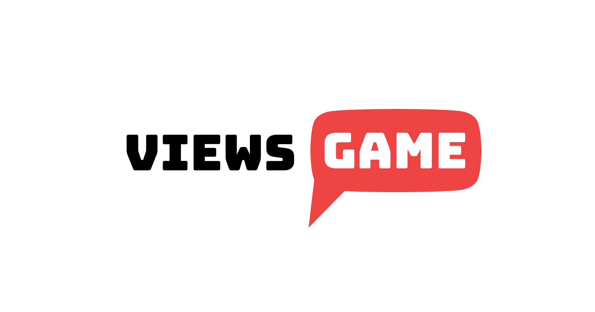

<!-- PROJECT LOGO -->
 

  

  <h3 align="center">VIEWS GAME</h3>

  

    The classic game of Higher-or-Lower, with a Youtube twist. 
     
    <a href="https://views-game.vercel.app/">View Demo</a>
    ·
    <a href="https://github.com/timotius02/views-game/issues">Report Bug</a>
    ·
    <a href="https://github.com/timotius02/views-game/issues">Request Feature</a>
  

<!-- ABOUT THE PROJECT -->

## About The Project

Inspired by the original Higher and Lower Game, this game has the player make guesses on whether a video has more or less views than another. You can guess videos made by specific creators or make custom playlists based on a public Youtube playlist.

### Built With

- [Remix](https://remix.run/)
- [React.js](https://reactjs.org/)
- [Tailwind](https://tailwindcss.com)
- [Prisma](https://www.prisma.io/)
- [Planetscale](https://planetscale.com/)
- [Youtube Data API](https://developers.google.com/youtube/v3)
- [Vercel](https://vercel.com/)

<!-- ROADMAP -->

## Roadmap

- [x] Add Custom playlist support for public youtube playlist
- [x] Add Search Page
- [ ] Add script to continually poll Youtube to update view counts
- [ ] Migrate Video-to-Playlist relation to Many-to-many after Prisma fixes their referrential integrity issues.
- [ ] Add more creators and playlists (Ongoing)

<!-- CONTACT -->

## Contact

Timotius Sitorus - [@timsitorus](https://twitter.com/timsitorus)

Project Link: [https://github.com/timotius02/views-game](https://github.com/timotius02/views-game)

<!-- ACKNOWLEDGMENTS -->

## Acknowledgments

Thanks to these

- [The OG Higher or Lower](https://choosealicense.comhttp://www.higherlowergame.com/) where I drew a lot of my inspirations from
- [Flaticons](https://www.flaticon.com/) for the icons
